# Mastodon Git Collaboration Tools - Step by Step Tutorials

## Installation

You need to activate two update sites in Fiji:

 - https://sites.imagej.net/TomancakLab
 - https://sites.imagej.net/Maarzt 

(The second update site is not in the list of update sites. You need to add it manually by clicking “Add Unlisted Site”)

Detailed instructions are below: Tutorial

## Installation - Detailed Step-by-Step Instructions

You need to activate two update sites in Fiji to install the Mastodon Git collaboration tools:

 - https://sites.imagej.net/TomancakLab
 - https://sites.imagej.net/Maarzt 

(The second update site is not in the list of update sites.
You need to add it manually by clicking “Add Unlisted Site”)

Also make sure not to activate too many other update sites.

Here is a detailed step by step tutorial how to activate the update sites:

Start ImageJ Updater

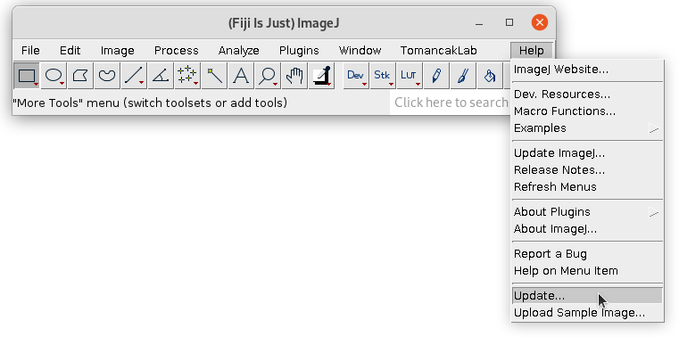

Click Manage Update Sites:

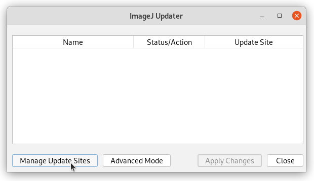

Search the TomancakLab update site and select it:

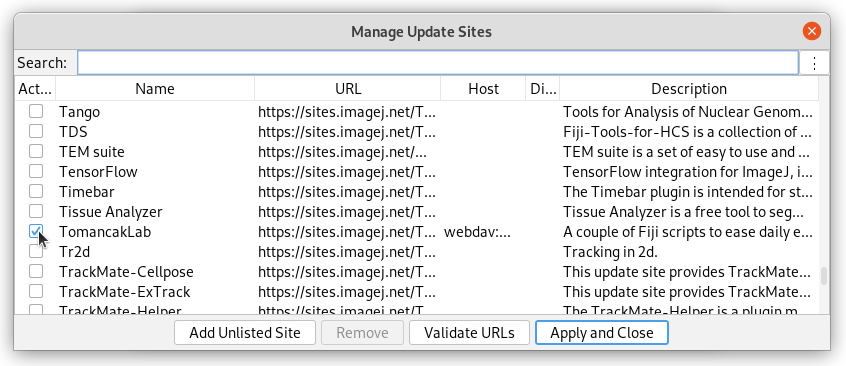

Next: Click “Add Unlisted Site”. A new almost empty line will appear in the table.

Please specify the URL: “https://sites.imagej.net/Maarzt/”

Change Name from “New” to “Maarzt” and select the new entry:

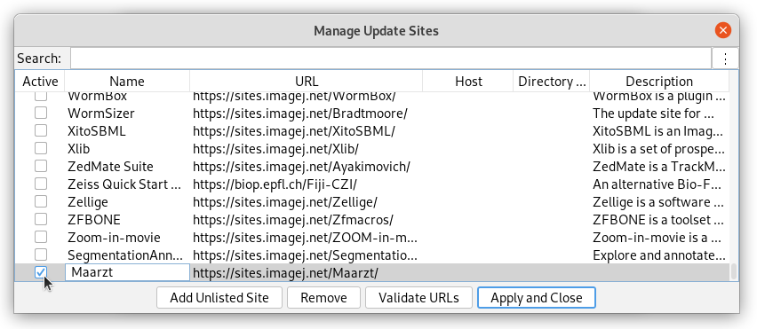

Click “Apply and Close”

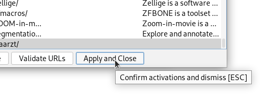

Click “Apply Changes”

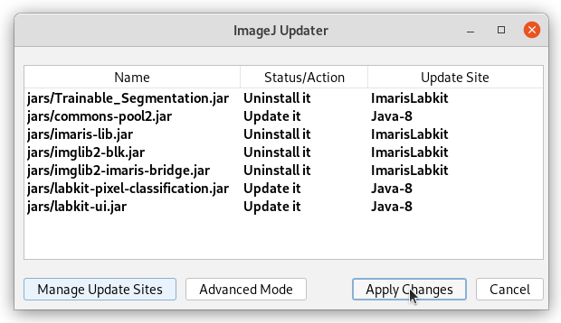

The final step is to restart Fiji, after this you should see an entry “Plugins > Mastodon Git > Download Shared Project” in the menu:

## Tutorial: How to Share a Project?

### 1. Create Empty Repository at GitLab

In your browser open: https://git.mpi-cbg.de

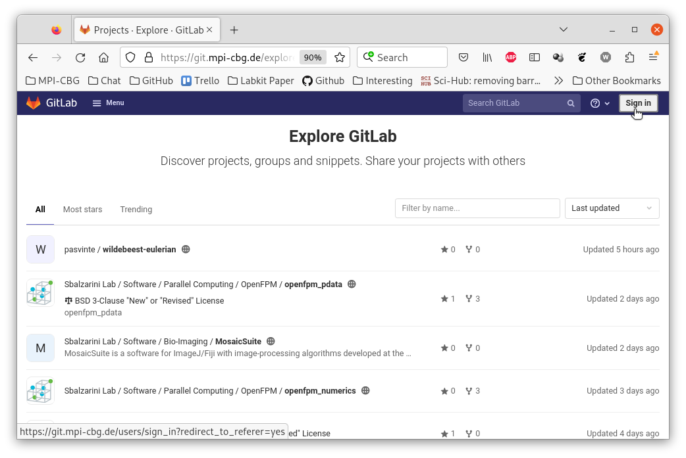

Click “Sign in”

You will see a list of project. Please click “New project” button in the top right corner:

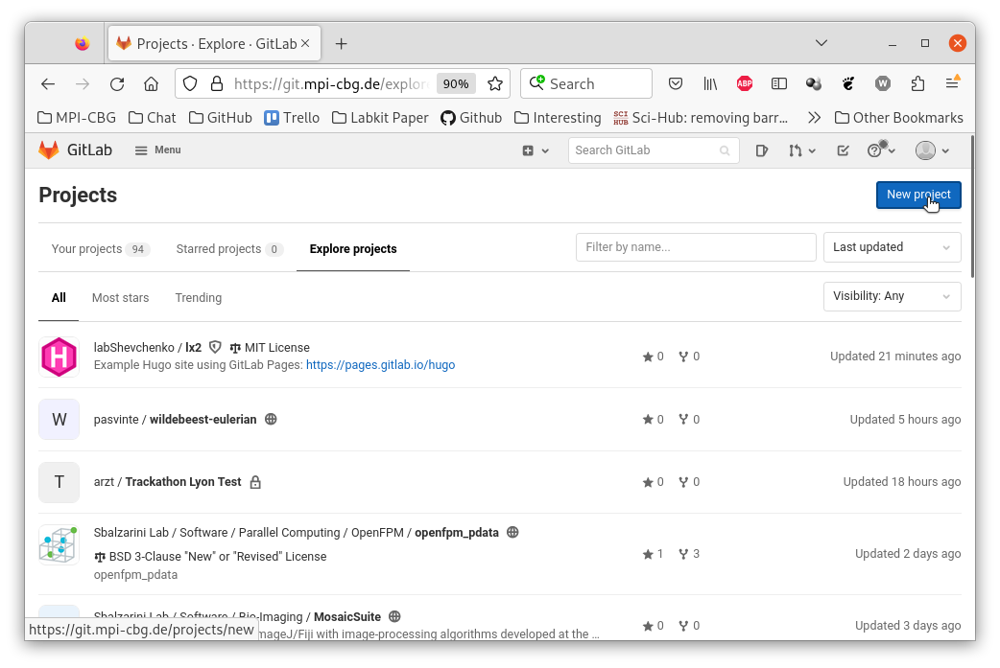

Next click “Create blank project”:

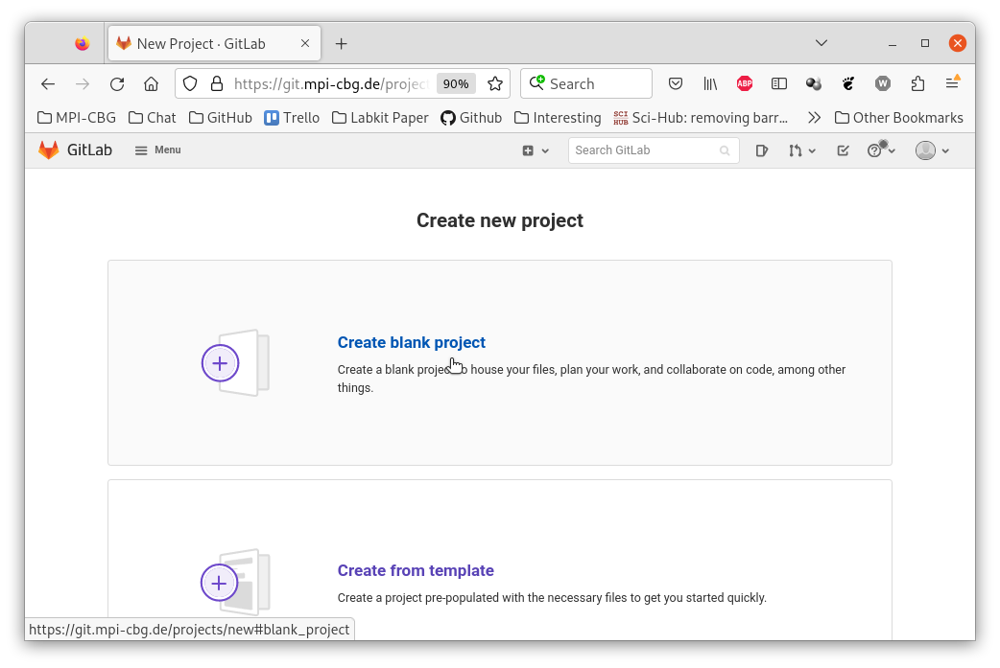

Provide project name and maybe a description. Then click “Create project”

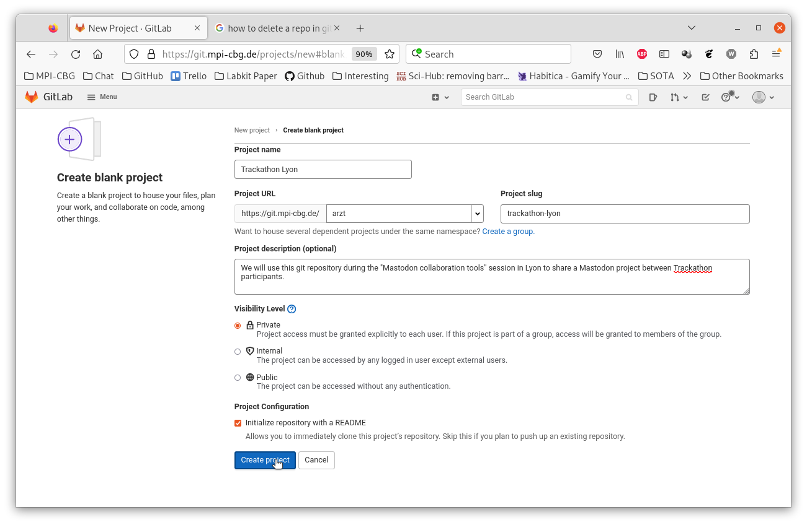

You will now see the landing page of your newly created git repository:

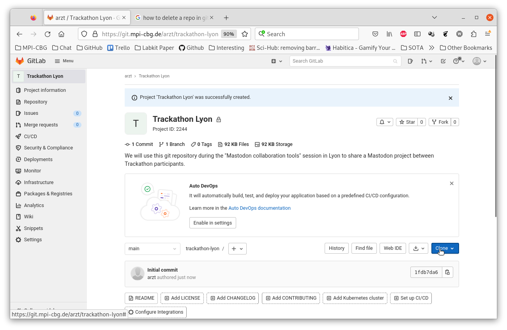

Next click “Clone” and copy the “https://git….” URL

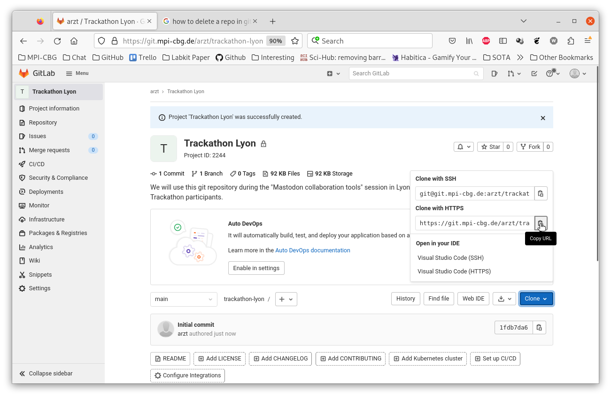

This URL will later be used to share the project from within Mastodon.

### 2. Upload Mastodon Project to GitLab

Open your Mastodon project on your computer with Fiji

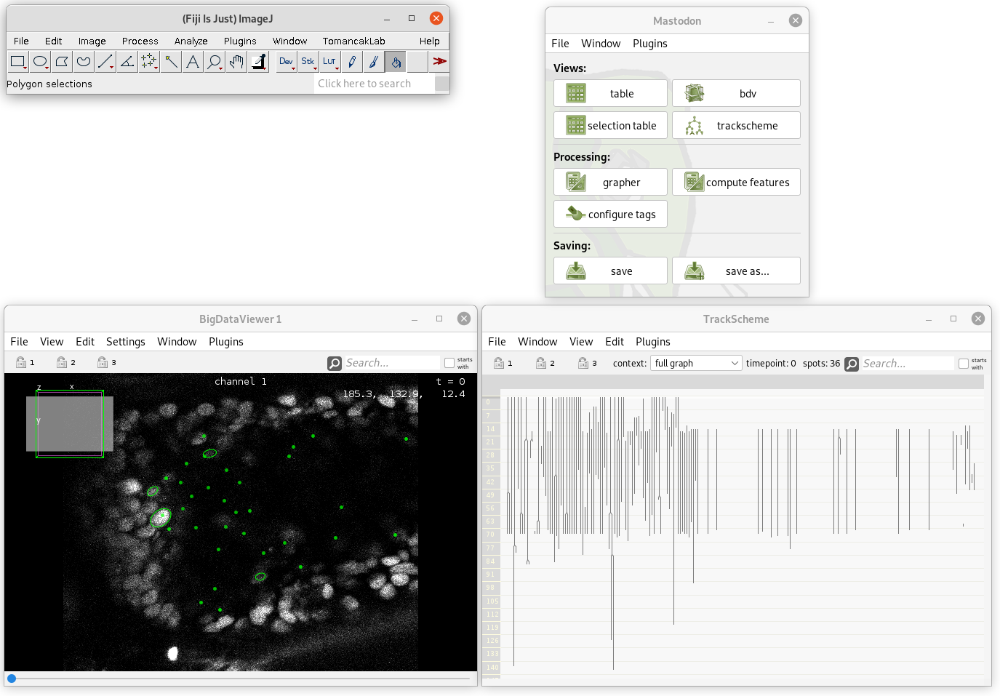

In the Mastodon menu click “Plugins > Git > Initialize > Share Project”

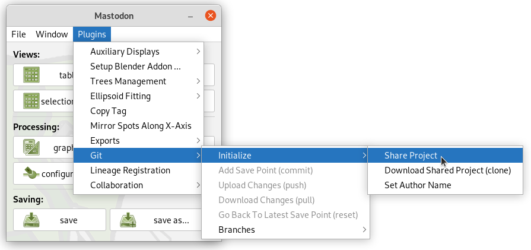

A window will open. In this window provide the URL that we copied at the end of step 1. And

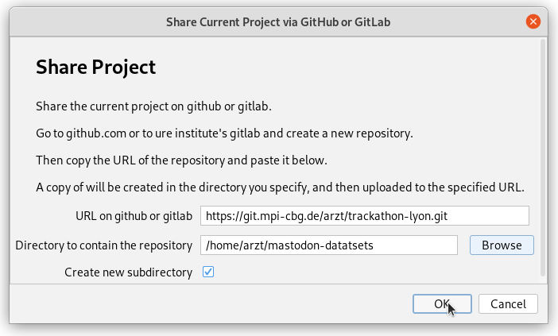

You will be asked for username and password

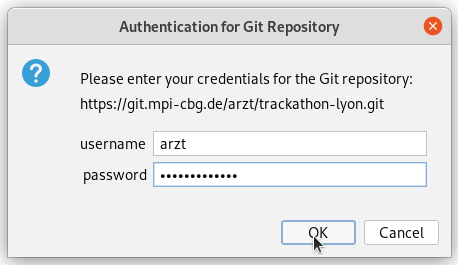

The mastodon project has now been uploaded to the GitLab server you can verify by going to the the git repositories landing page. In our case:

https://git.mpi-cbg.de/arzt/trackathon-lyon (The git repository is private. You can only access the landing page, if you are invited to the repository.)

You should see a entry “mastodon.project”

## Tutorial: How to Contribute to a Shared Project?

### 1. Get access to the repository

Use your user account to log into https://git.mpi-cbg.de

(You can only be invited to a repository after you logged into the gitlab server for the first time)

Ask the owner of the “trackathon-lyon” for an invitation to the repository.

You should get an invitation email. Please confirm the invitation.

After this you should be able to open the landing page of the git repository: https://git.mpi-cbg.de/arzt/trackathon-lyon

(The repository is private, you will see an error message if you are not invited to the repository yet)

Alternative:

There’s an alternative, if logging into git.mpi-cbg.de doesn’t work for you.
Ask the owner of the shared project for an access token.
This access token can be used with the Mastodon Git collaboration tools to clone
the project and to upload changes.
When asked for username and password, you can simply specify the access token as the username and leave the password empty.

### 2. Download Shared Project

In Fiji click “Plugins > Mastodon Git > Download Shared Project”

A dialog window “Mastodon Git - Download Shared Project (clone)” will show up.

Please enter the URL of the shared projects repository.

Select a directory where to save a copy of the shared project on your hard drive.

Finally click ok.

You will be asked for your username and password for “git.mpi-cbg.de”.

After you give your credentials. Mastodon will download the shared project, save a copy to the directory on your hard drive and open the project. Even the image data should be visible, if BigDataServer is linked, set up correctly and running.

**Alternative to BigDataServer:**

You may download the XML/HDF5 dataset and store it on your computer.

In Mastodon click “File > Fix Image Path” and select the “trackathon.xml” file on your computer.

You need to restart Mastodon for these changes to take effect. So close Mastodon. Start the Mastodon Launcher (in the Fiji menu click “Plugins > Mastodon”). Select the directory on you hard drive, that you specified earlier, it should have a sub directory with the name “mastodon.project”. Select this directory and click open.

### 3. Specify Your Author (Nick-)Name

Specify a nickname. This name will be shown on the GitLab server and help to identify the changes that you uploaded.

In the Mastodon menu click “Plugins > Git > Initialize > Set Author Name”

Enter a nickname in the dialog. Maybe don’t specify your email. Click OK.

### 4. Create A New Branch

In the Mastodon menu click “Plugins > Git > Branches > Create New Branch”

Specify a name for the new branch and click ok. The name could be a lowercase version of your nickname:

### 5. Track some cells in Mastodon

Follow the normal cell tracking business.

### 6. Add Save Point

(This step will save the Mastodon project into the git repository. Additionally "save point" will be created. A "save point" can be recovered later on.)

In the Mastodon menu click “Plugins > Git > Add Save Point”.

It is best practice to provide a short text that describes the changes you made. (This message will later on help to understand what changes were made. It can help to find this specific version of the project.)

### 7. Upload Changes

(Until now, your changes and save points are only stored locally on your computer. In your copy of the shared project. This step will upload the changes to the remote server such that they become “visible” for your colleagues.)

Simply click “Plugins > Git > Upload Changes”

There are three potential outcomes:
1. You get a notification that everything worked well.
2. You get a notification that there are already new changes on the remote server, that you have to download changes for the remote server first. (This should not happen if you created your own branch properly.)
3. Another problem (server connection etc.)

### 8. Repeat steps 5 – 7

Be productive: track cells, add a save point, upload your changes.

### 9. Optional: Verify that your changes are on the server

Go to https://git.mpi-cbg.de/arzt/trackathon-lyon-test

Log in with your username and password

You will see the lading page of our project’s git repository:

Please click on “History” and than select your branch name that you specified earlier:

You will see a list of changes. Your latest save point message should be on the top of the list. In this case it is “Tracked 5125”.

### 10. Optional: create a merge request on GitLab / GitHub:

You may create a merge request. This will notify the owner of the repository that you branch contains valuable changes that should be merged into the “main” branch of the project:

First follow the steps described in “10. Verify, that your changes are on the remote server.”

In the list of you changes, click “Create merge request”.

On the next page provide a title and description to sum up your changes:Click “Create merge request”.

Your merge request is now listed on https://git.mpi-cbg.de/arzt/trackathon-lyon/-/merge_requests

And the owner of the project will get an email that notifies him about your merge request.

