## Tutorial: How to Contribute to a Shared Project?
**(With Mastodon Git Collaboration Tools)**

### 1. Get access to the repository

The first step is to get access to the git repository that is used to share a Mastodon project.

Mastodon projects are most likely shared via private git repositories.
The owner of the project / repository might have sent you a link, and asked you to contribute to the project.
If you click on this link you will be asked for username and password. 
You will need to create an account, if you don’t have one already.
After you have created an account you need to log in, and then ask the project owner to invite you to the project.
You will then receive an email with a link to accept the invitation.
Only after you have accepted the invitation you will be able to follow the next steps and download the project.

**Alternative:**

The owner of the shared project can also send you a socalled “access token”.
This works without the need for an account on the GitLab server.
The trick is to use the access token as username and leave the password field empty.

### 2. Download Shared Project

In Fiji click “Plugins > Mastodon Git > Download Shared Project”

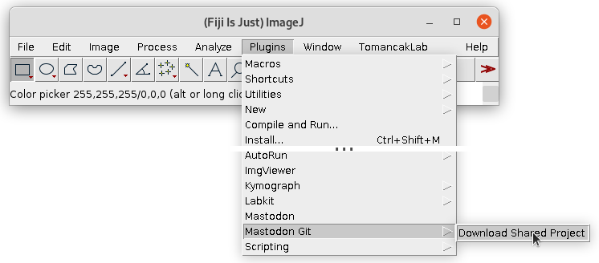

A dialog window “Mastodon Git - Download Shared Project (clone)” will show up.

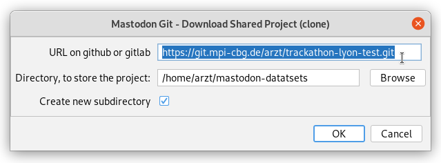

Please enter the URL of the shared projects repository.

Select a directory where to save a copy of the shared project on your hard drive.

Finally click ok.

You will be asked for your username and password for “git.mpi-cbg.de”.

After you give your credentials. Mastodon will download the shared project, save a copy to the directory on your hard drive and open the project. Even the image data should be visible, if BigDataServer is linked, set up correctly and running.

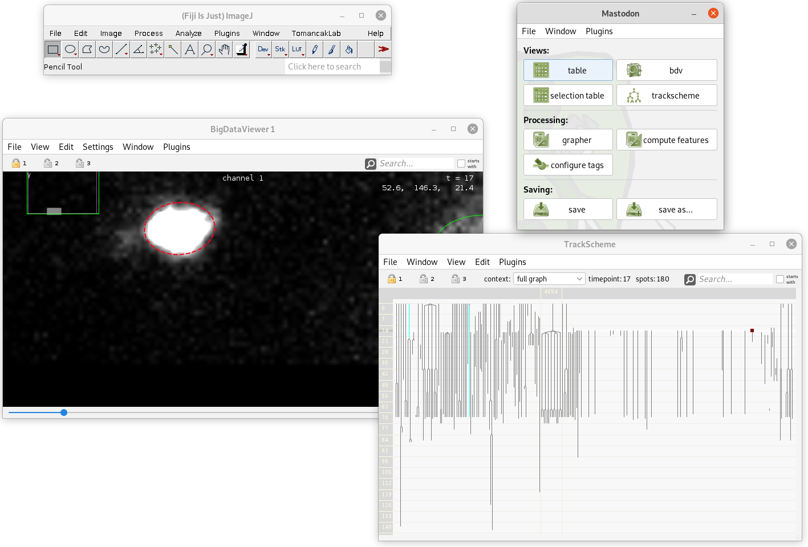

**Alternative to BigDataServer:**

You may download the XML/HDF5 dataset and store it on your computer.

In Mastodon click “File > Fix Image Path” and select the “trackathon.xml” file on your computer.

You need to restart Mastodon for these changes to take effect. So close Mastodon. Start the Mastodon Launcher (in the Fiji menu click “Plugins > Mastodon”). Select the directory on you hard drive, that you specified earlier, it should have a sub directory with the name “mastodon.project”. Select this directory and click open.

### 3. Specify Your Author (Nick-)Name

Specify a nickname. This name will be shown on the GitLab server and help to identify the changes that you uploaded.

In the Mastodon menu click “Plugins > Git > Initialize > Set Author Name”

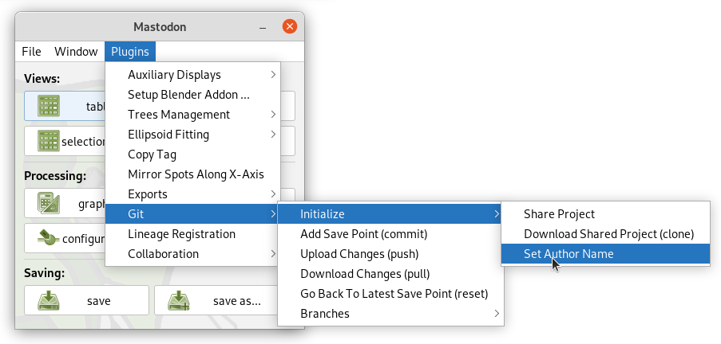

Enter a nickname in the dialog. Maybe don’t specify your email. Click OK.

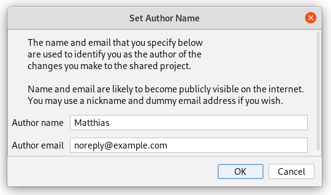

### 4. Create A New Branch

In the Mastodon menu click “Plugins > Git > Branches > Create New Branch”

Specify a name for the new branch and click ok. The name could be a lowercase version of your nickname:

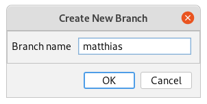

### 5. Track some cells in Mastodon

Follow the normal cell tracking business.

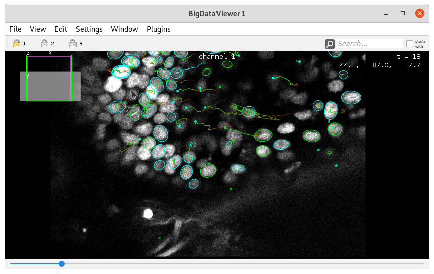

### 6. Add Save Point

(This step will save the Mastodon project into the git repository. Additionally "save point" will be created. A "save point" can be recovered later on.)

In the Mastodon menu click “Plugins > Git > Add Save Point”.

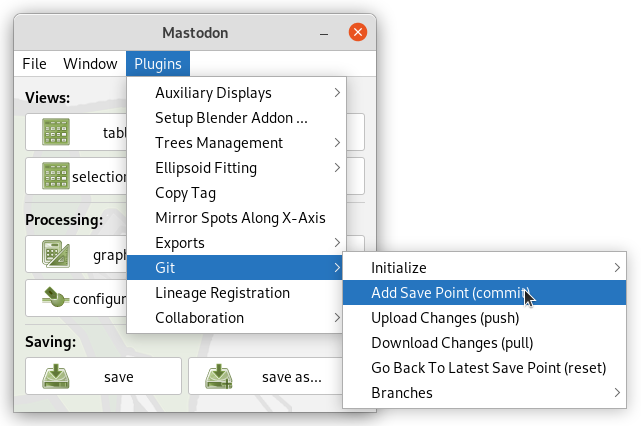

It is best practice to provide a short text that describes the changes you made. (This message will later on help to understand what changes were made. It can help to find this specific version of the project.)

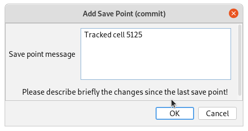

### 7. Upload Changes

(Until now, your changes and save points are only stored locally on your computer. In your copy of the shared project. This step will upload the changes to the remote server such that they become “visible” for your colleagues.)

Simply click “Plugins > Git > Upload Changes”

There are three potential outcomes:
1. You get a notification that everything worked well.
2. You get a notification that there are already new changes on the remote server, that you have to download changes for the remote server first. (This should not happen if you created your own branch properly.)
3. Another problem (server connection etc.)

### 8. Repeat steps 5 – 7

Be productive: track cells, add a save point, upload your changes.

### 9. Optional: Verify that your changes are on the server

Go to https://git.mpi-cbg.de/arzt/trackathon-lyon-test

Log in with your username and password

You will see the lading page of our project’s git repository:

Please click on “History” and than select your branch name that you specified earlier:

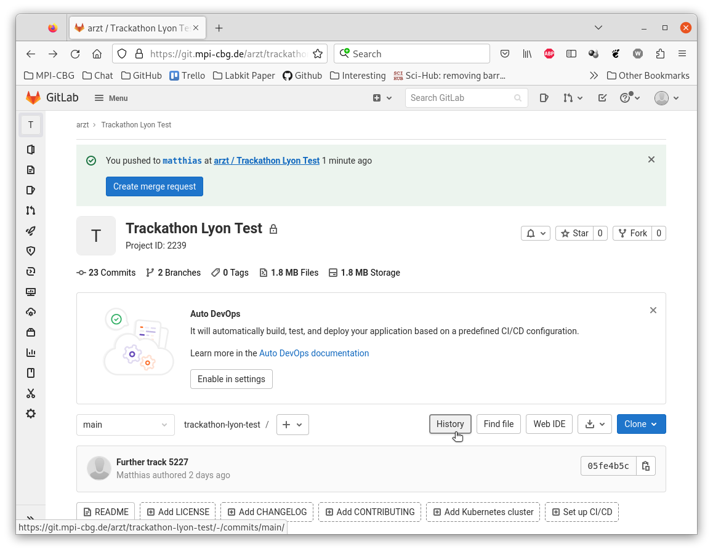

You will see a list of changes. Your latest save point message should be on the top of the list. In this case it is “Tracked 5125”.

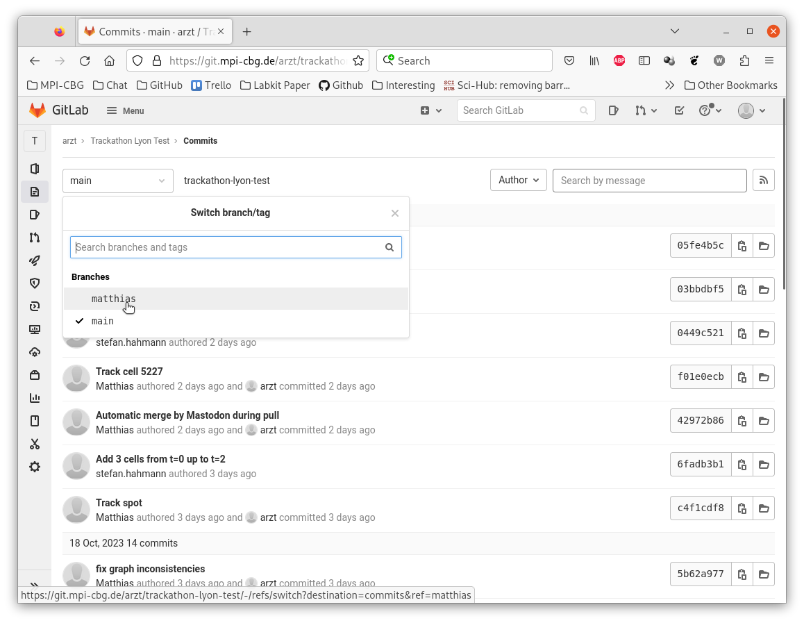

### 10. Optional: create a merge request on GitLab / GitHub:

You may create a merge request. This will notify the owner of the repository that you branch contains valuable changes that should be merged into the “main” branch of the project:

First follow the steps described in “10. Verify, that your changes are on the remote server.”

In the list of you changes, click “Create merge request”.

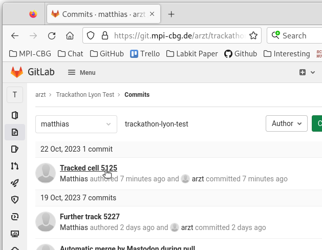

On the next page provide a title and description to sum up your changes:Click “Create merge request”.

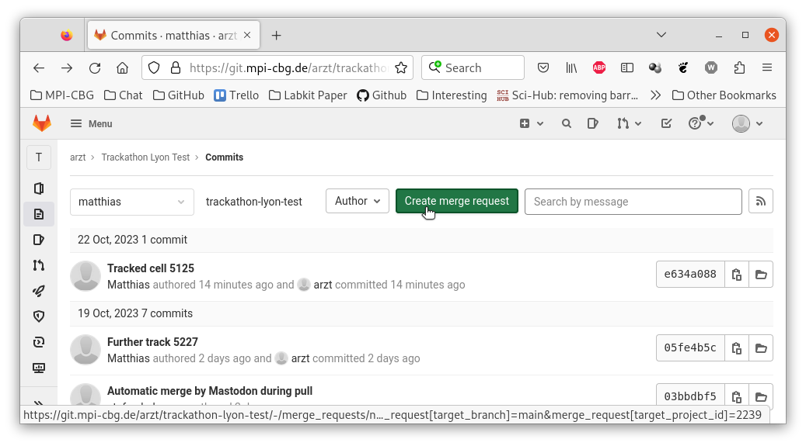

Your merge request is now listed on https://git.mpi-cbg.de/arzt/trackathon-lyon/-/merge_requests

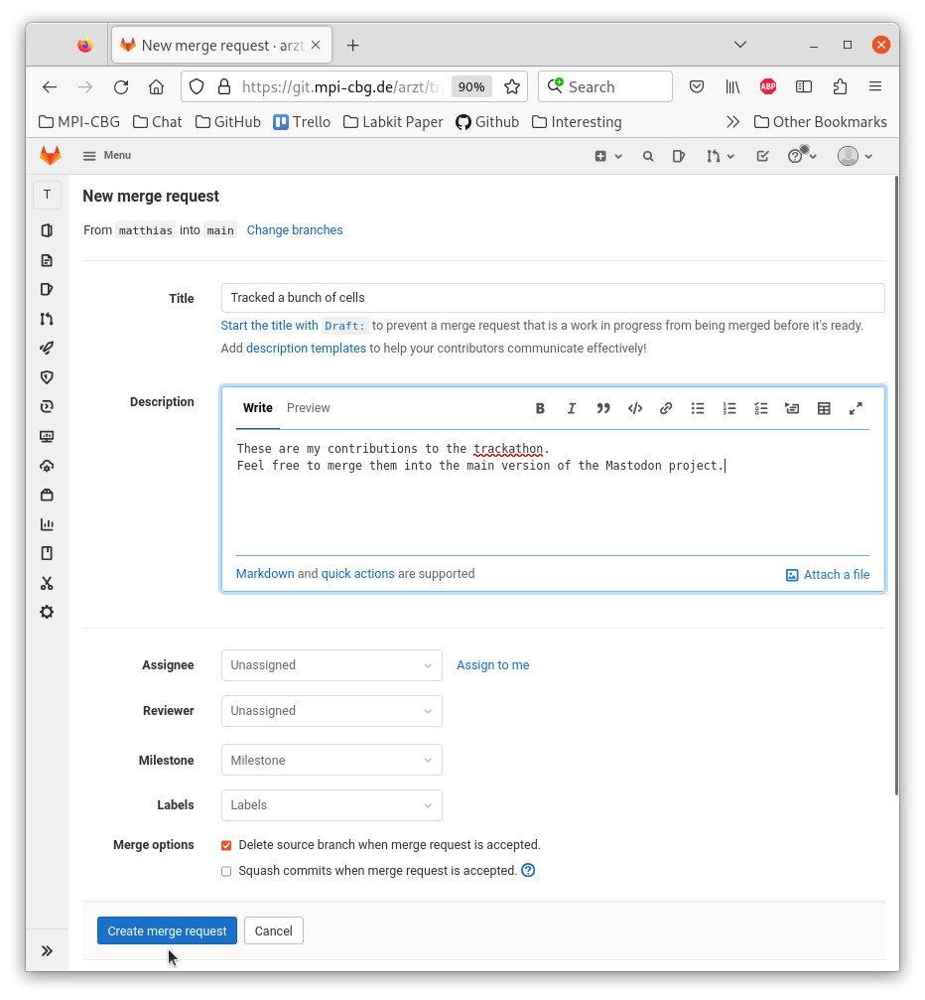

And the owner of the project will get an email that notifies him about your merge request.

